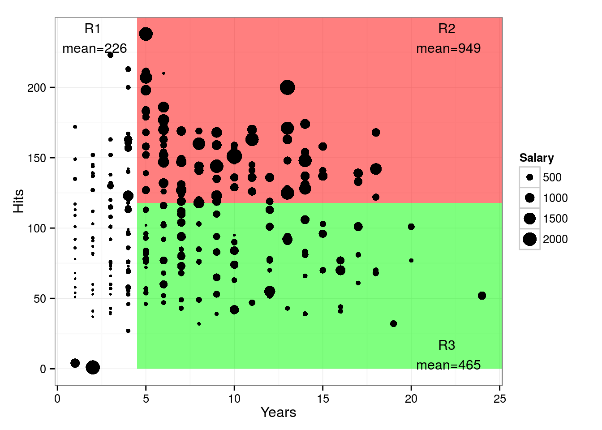

```{r packages, echo=FALSE}
knitr::read_chunk("009-packages.R")
```

```{r required-packages, echo=FALSE, warning=FALSE,message=FALSE,results='hide'}
```


```{r setup,echo=FALSE,warning=FALSE,message=FALSE}
cleanbib()
options("citation_format" = "pandoc")
data("Hitters")
bib <- read.bibtex("009-bibliography.bib")
```


## Tree-based Methods

* Involves _splitting_ the predictor space into simple regions
* Since the set of splitting rules used to segment the
predictor space can be summarized in a tree, these types of
approaches are known as decision-tree methods [@islr]

## Baseball Data

```{r test, echo=FALSE, eval=1}
DT.hit <- as.data.table(Hitters)
datatable(Hitters[,c("Years","Hits","Salary")], options = list(iDisplayLength = 10))
```


## Predict salary based on Hits and Years Played

```{r, fig.align='center', echo=FALSE, warning=FALSE}
p <- ggplot(DT.hit, aes(Years, Hits))
p + theme_bw()+geom_point(aes(size = Salary))+scale_size_area()
```


## How to split the data

```{r, fig.align='center', echo=FALSE, warning=FALSE, cache=TRUE}
p <- ggplot(DT.hit, aes(Years, Hits))
p + theme_bw()+annotate("rect",xmin = 4.5, xmax = Inf, ymin = 0,    ymax = Inf, fill="red", alpha=0.5)+ geom_point(aes(size = Salary))+scale_size_area()+ annotate("text", label = "R2\n mean=697", x = 22, y = 220, size = 5)+annotate("text", label = "R1\n mean=226", x = 2, y = 220, size = 5)
```


## How to split the data

```{r p2, fig.align='center', echo=FALSE, warning=FALSE, cache=TRUE}
p <- ggplot(DT.hit, aes(Years, Hits))
p + theme_bw()+annotate("rect",xmin = 4.5, xmax = Inf, ymin = 118, ymax = Inf, fill="red", alpha=0.5)+annotate("rect", xmin = 4.5, xmax = Inf, ymin = 0, ymax = 118, fill="green", alpha=0.5)+geom_point(aes(size = Salary))+scale_size_area()+ annotate("text", label = "R2\n mean=949", x = 22, y = 235, size = 4)+annotate("text", label = "R1\n mean=226", x = 2, y = 235, size = 4)+annotate("text", label = "R3\n mean=465", x = 22, y = 10, size = 4)
```


## How to split the data

```{r p4, fig.align='center', echo=FALSE, warning=FALSE, cache=TRUE}
p <- ggplot(DT.hit, aes(Years, Hits))
p + theme_bw()+annotate("rect",xmin = 4.5, xmax = Inf, ymin = 118, ymax = Inf, fill="red", alpha=0.5)+annotate("rect", xmin = 15, xmax = Inf, ymin = 0, ymax = 118, fill="green", alpha=0.5)+annotate("rect", xmin = 4.5, xmax = 15, ymin = 0, ymax = 118, fill="blue", alpha=0.5)+
    geom_point(aes(size = Salary))+scale_size_area()+ annotate("text", label = "R2\n mean=949", x = 22, y = 235, size = 4)+annotate("text", label = "R1\n mean=226", x = 2, y = 235, size = 4)+annotate("text", label = "R3\n mean=332", x = 8, y = 10, size = 4)+annotate("text", label = "R4\n mean=615", x = 22, y = 10, size = 4)
```

## How to split the data

```{r p5, fig.align='center', echo=FALSE, warning=FALSE, cache=TRUE}
p <- ggplot(DT.hit, aes(Years, Hits))
p + theme_bw()+annotate("rect",xmin = 4.5, xmax = Inf, ymin = 118, ymax = Inf, fill="red", alpha=0.5)+annotate("rect", xmin = 15, xmax = Inf, ymin = 0, ymax = 118, fill="green", alpha=0.5)+annotate("rect", xmin = 4.5, xmax = 15, ymin = 0, ymax = 118, fill="blue", alpha=0.5)+annotate("rect", xmin = 17.5, xmax = Inf, ymin = 118, ymax = Inf, fill="yellow", alpha=0.5)+annotate("rect", xmin = 22, xmax = Inf, ymin = 0, ymax = 58, fill="purple", alpha=0.5)+geom_point(aes(size = Salary))+scale_size_area()+ annotate("text", label = "R2\n mean=975", x = 22, y = 235, size = 4)+annotate("text", label = "R1\n mean=226", x = 2, y = 235, size = 4)+annotate("text", label = "R3\n mean=332", x = 8, y = 10, size = 4)+annotate("text", label = "R4\n mean=504", x = 17, y = 10, size = 4)+annotate("text", label = "R5\n mean=1100", x = 23, y = 10, size = 4)+annotate("text", label = "R6\n mean=862", x = 10, y = 235, size = 4)
```


## Regression Tree for Baseball data
<div class="columns-2">

```{r p3,echo=FALSE,fig.align='center',fig.keep='high',cache=TRUE, fig.width=5}
bag2 <- rpart::rpart(Salary ~ Hits + Years, data=DT.hit[!is.na(Salary)], method="anova")
# prune the tree 
pfit<- prune(bag2, cp=   bag2$cptable[which.min(bag2$cptable[,"xerror"]),"CP"])

# plot the pruned tree 
rpart.plot(pfit, type=1, extra=1, uniform = FALSE)
```

    - Years is the most important factor in 
    determining Salary
    - Given that a player is less 
    experienced, the number of Hits that 
    he made in the previous year seems 
    to play little role in his Salary
    - Among players who have been in 
    the major leagues for five or more years, 
    the number of Hits made in the previous 
    year does affect Salary
    
</div>

## Decision Tree

<div class="columns-2">




</div>

## More Details of Tree Building

> - The goal is to find boxes $R_1,\ldots, R_J$ that minimize the residual sum of squares give by

> - $$ \sum_{j=1}^J \sum_{i \in R_j} (y_i - \hat{y}_{Rj}) $$

> - $y_i$ is the subjects response, $\hat{y}_{Rj}$ is the mean in box $j$

> - Computationally infeasible to consider every single partition of the feature space into J boxes

> - Solution: take a top-down, greedy approach

> - Begins at the top, and never looks back
    
## Pros and Cons

> - Tree-based methods are simple and useful for interpretation
> - Highly sensity to the first split
> - Solution: Combining a large number of trees can often result in
dramatic improvements in prediction accuracy, at the
expense of some loss interpretation.